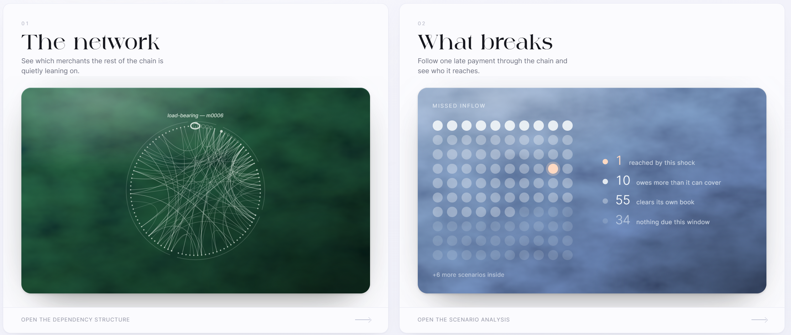
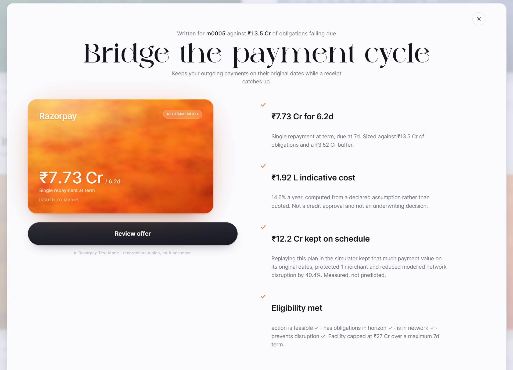
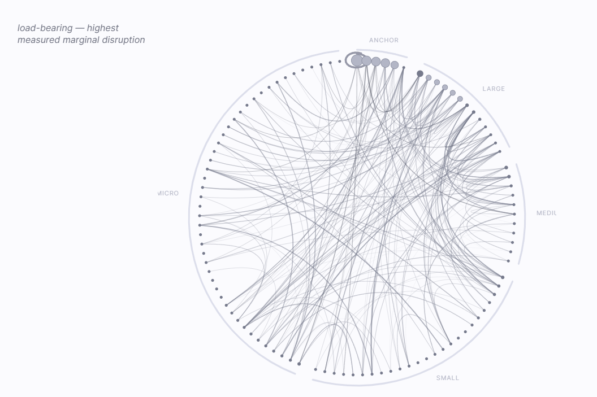
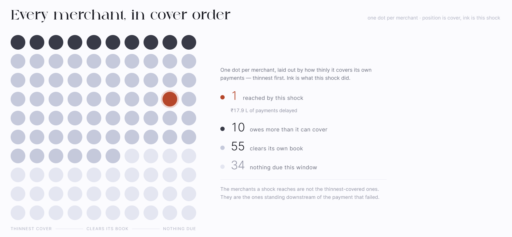

# Keystone






**A liquidity shock at one merchant, followed all the way to the capital that stops it.**

Merchants on a payment platform do not fail independently. A supplier who is
paid late pays their own suppliers late, and the delay travels along the same
edges the money does. The platform is the only party that can see those edges —
it processes both sides of the transaction — and is therefore the only party
that can tell the difference between a merchant who is genuinely short of cash
and a merchant who is short because someone upstream was.

Keystone is a decision engine for that difference. It answers four questions in
order:

1. **Where does payment dependence actually live?** Estimate the network from
   transaction history alone — who pays whom, how much passes through, with
   what lag and what reliability.
2. **What breaks when one payment fails?** Simulate the shock through that
   network and measure who becomes liquidity-constrained, by how much, and when.
3. **Where does one rupee do the most work?** Search over candidate
   interventions, replay each plan against the same shock, and report the
   difference between the two runs.
4. **What should be offered, to whom?** Turn the selected action into a
   structured liquidity offer sized to that merchant's own payment cycle.

The distinguishing claim is in step 3. Most systems predict which merchants are
at risk. Keystone measures what an intervention *achieved* by replaying it —
the recommendation is scored by the simulator, not by the model that proposed it.

---

## Research basis

This work builds on:

**Programmable Repayment: Risk-Sharing and Enforcement Through the Payment
Platform** — Kumar Rishabh and Alessandro Di Stefano, 7 May 2026.
[SSRN 6729024](https://papers.ssrn.com/sol3/papers.cfm?abstract_id=6729024)

The paper's argument is that a payment platform can enforce and share risk in
ways a lender outside the flow cannot, because repayment can be made a property
of the payment rail itself. Keystone takes that premise and asks the operational
question it implies: if the platform can place liquidity anywhere in the network,
*where* should it go? That is a network problem, not a credit-scoring problem,
and it is the problem this repository solves.

---

## What is in here

| | |
| --- | --- |
| `src/lce/domain` | Payment graph, dependency estimation, cascade propagation, the disruption objective |
| `src/lce/simulation` | Discrete-event liquidity simulator over a 168-hour horizon |
| `src/lce/optimization` | Intervention search, systemic-importance ranking, counterfactual replay |
| `src/lce/data` | Synthetic network generator with known ground truth |
| `src/lce/api` | FastAPI service |
| `src/lce/snapshot` | Precomputed analytical snapshot the API serves |
| `frontend` | The Keystone interface — four panels, each opening onto its analysis |

The default benchmark is a 100-merchant network with 216 estimated
relationships and seven analysed shock scenarios.

## Running it

```bash
pip install -e ".[dev]"
python -m lce.cli serve --host 127.0.0.1 --port 8000
```

```bash
cd frontend && npm install && npm run dev
```

The frontend proxies `/api` to the backend and has no data of its own. If the
service is down the page says so rather than rendering a plausible number.
See [`frontend/README.md`](frontend/README.md) for the interface, and
[`BACKEND_FREEZE_REPORT.md`](BACKEND_FREEZE_REPORT.md) for the architecture,
benchmarks and verified provider capabilities.

## Three things worth stating plainly

**The benchmark is synthetic, and that is the point.** Every metric is measured
on networks whose generating process is known, so the model can be *scored*
rather than demonstrated. No claim is made here about real-world predictive
accuracy.

**Nothing moves money.** Razorpay integration runs in Test Mode and is used for
connectivity and capability probing. Route and Direct Transfers are not enabled
on the test account — probed, not assumed — so every recommendation is recorded
as a plan.

**The offers are model output, not credit decisions.** Amounts, terms and
indicative costs are computed under stated assumptions. They are not quotes and
not underwriting.
