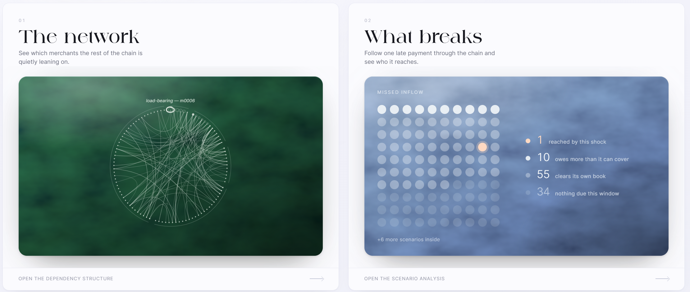
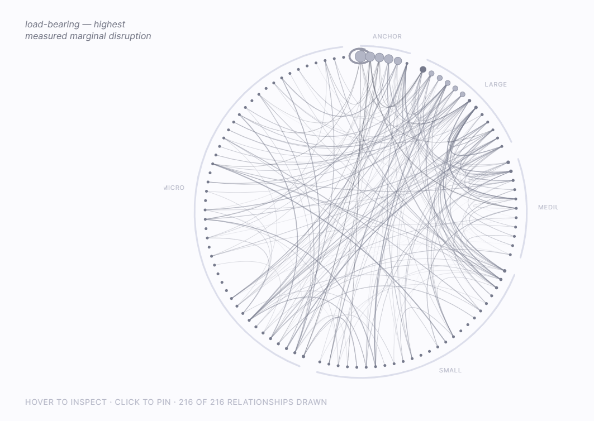
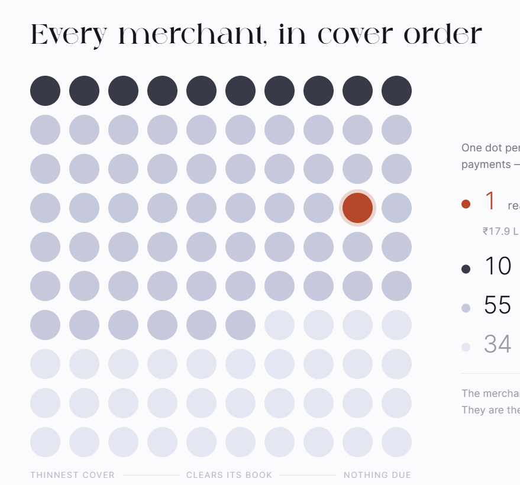

# Explainer diagrams

Four Excalidraw scenes. `preview.png` shows all four as Excalidraw renders them.

| File | What it explains |
| --- | --- |
| `01-architecture` | The network, the shock, and the node where capital stops it |
| `02-data` | Where the data comes from — benchmark and provider, kept separate |
| `03-mathematics` | The objective, its three terms, and what is read off it |
| `04-method` | Propose, replay, measure — and why that order matters |

**Paste one onto a canvas:** open the `.json`, select all, copy, paste into
[excalidraw.com](https://excalidraw.com).

**Open one as a scene:** drag the `.excalidraw` file onto excalidraw.com.
`keystone-diagrams.excalidraw` holds all four in one scene.

Line-art throughout. One accent (`#b5462a`) marks the single thing that matters in
each diagram — where capital is placed, the plan the provider cannot execute, the
fact that D is an index, the step that is actually measured.
